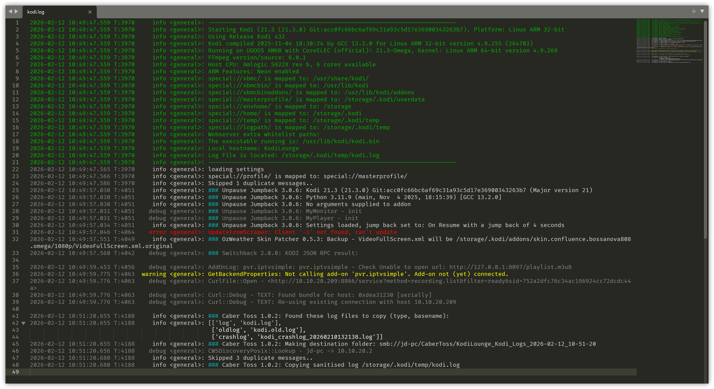

# Kodi Log Highlighter

Syntax highlighting for Kodi log files in Sublime Text.



## Features

- **Automatic detection** of Kodi log files (`kodi*.log`)
- **Colour-coded log levels**:
  - Error messages in red
  - Warning messages in yellow
  - Info messages in light grey
  - Debug messages in mid grey
- **Green highlighting** for:
  - Header sections (bounded by separator lines)
  - `###` markers in log output
- **Red highlighting** for crashlog headers
- **Grey timestamps** on all log lines
- **Word wrap disabled** by default for easier log reading

## Supported Files

- `kodi.log`
- `kodi.old.log`
- `kodi_crashlog_*.log`
- Any file matching `kodi*.log` pattern

## Installation

### Package Control

1. Open Command Palette (`Ctrl+Shift+P` / `Cmd+Shift+P`)
2. Select "Package Control: Install Package"
3. Search for "Kodi Log Highlighter"
4. Press Enter to install

### Manual Installation

1. Download the [latest release](https://github.com/bossanova808/kodi-log-highlighter/releases)
2. Extract to your Sublime Text Packages folder:
   - **Windows**: `%APPDATA%\Sublime Text\Packages\`
   - **macOS**: `~/Library/Application Support/Sublime Text/Packages/`
   - **Linux**: `~/.config/sublime-text/Packages/`
3. Rename the folder to `Kodi Log Highlighter`
4. Restart Sublime Text

## Usage

The syntax will automatically apply to files matching the `kodi*.log` pattern. You can also manually select it:

1. Open a Kodi log file
2. Click the syntax selector in the bottom-right corner
3. Select "Kodi Log Highlighter" from the list

## Customization

### Change Colours

To customize colours, edit your colour scheme (via `Preferences > Customize Colour Scheme`) and add rules for these scopes:

```json
{
    "rules": [
        {
            "scope": "kodi.header",
            "foreground": "#00AA00"
        },
        {
            "scope": "kodi.hash",
            "foreground": "#00AA00"
        },
        {
            "scope": "kodi.error",
            "foreground": "#FF0000"
        },
        {
            "scope": "kodi.warning",
            "foreground": "#FFFF00"
        },
        {
            "scope": "kodi.info",
            "foreground": "#CCCCCC"
        },
        {
            "scope": "kodi.debug",
            "foreground": "#808080"
        },
        {
            "scope": "kodi.timestamp",
            "foreground": "#808080"
        },
        {
            "scope": "kodi.crashlog.header",
            "foreground": "#FF0000"
        }
    ]
}
```

### Change Settings

To modify settings (like enabling word wrap), go to:
`Preferences > Settings - Syntax Specific`

Available settings:
```json
{
    "word_wrap": false  // Change to true to enable word wrap
}
```

## License

GPL-3.0 License

## Contributing

Issues and pull requests welcome on GitHub

## Changelog

### 1.0.0
- Initial release
- Support for standard Kodi logs, old logs, and crashlogs
- Colour-coded log levels
- Header and crashlog header highlighting
- Automatic file detection
